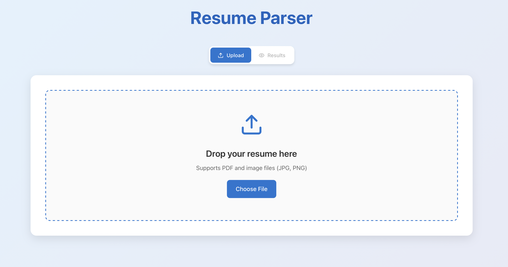
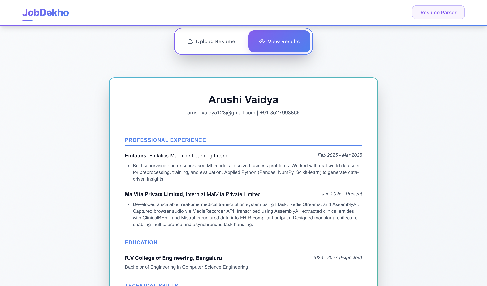

# 📄 Resume Parser - Local AI Edition

A completely **free** and **private** resume parser that runs AI models locally on your computer.  
Extract, structure, and beautifully present resume data from PDFs and images — all without sending data to external services.

---

## ✨ Features

- **🔒 100% Private:** All processing happens locally - your data never leaves your computer
- **💰 Completely Free:** No API keys, no subscriptions, no hidden costs
- **🤖 Local AI Parsing:** Uses Ollama for high-quality AI extraction with fallback to rule-based parsing
- **📁 Multiple Formats:** Supports PDF and image files (JPG, PNG)
- **📊 Rich Data Extraction:** Personal info, experience, education, projects, achievements, certificates, skills, and more
- **🎨 Beautiful UI:** Professional, responsive, and easy-to-use interface
- **📥 Instant Templates:** Download clean, modern HTML resume templates
- **⚡ No Backend Required:** Pure client-side application

---

## 🖼️ Screenshots

| Upload & AI Status               | Parsed Results                |
|:--------------------------------:|:-----------------------------:|
|  |  |

---

## 🚀 Quick Start

### Method 1: Basic Usage (Works Immediately)
```bash
git clone https://github.com/yourusername/resume-parser.git
cd resume-parser
npm install
npm start
```
Open [http://localhost:3000](http://localhost:3000) and start uploading resumes!

*Note: Without Ollama, the app uses rule-based extraction which works but is less accurate.*

### Method 2: Full AI Setup (Recommended)

#### 1. Install Ollama
- Visit [ollama.ai](https://ollama.ai) and download for your OS
- Install and start Ollama

#### 2. Pull an AI Model
```bash
# Recommended: Excellent for structured data extraction
ollama pull qwen2.5:7b

# Alternative options:
ollama pull llama3.2:3b         # Faster but less accurate
ollama pull mistral:7b          # Good alternative
ollama pull gemma2:2b           # Fastest option
```

#### 3. Start the App
```bash
npm start
```

The app will automatically detect Ollama and show "Ollama Connected" status.

---

## 📋 Supported Models

| Model | Size | Speed | Accuracy | Best For |
|-------|------|-------|----------|----------|
| `qwen2.5:7b` | 4.4GB | Medium | **Excellent** | **Recommended - best for resume parsing** |
| `llama3.2:3b` | 2.0GB | Fast | High | Quick processing |
| `mistral:7b` | 4.1GB | Medium | Very High | Complex resumes |
| `gemma2:2b` | 1.6GB | Very Fast | Medium | Basic extraction |

---

## ⚙️ Project Structure

```
resume-parser/
  ├── public/
  ├── src/
  │   ├── App.js              # Main component with Ollama integration
  │   ├── ResumeParser.css    # Styling
  │   └── ...
  ├── package.json            # No API dependencies!
  └── README.md
```

---

## 🧠 How It Works

1. **📤 Upload:** Drag & drop or select a PDF/image resume
2. **🔍 Extract:** Text extracted using PDF.js or Tesseract.js
3. **🤖 Parse:** 
   - **With Ollama:** AI model processes text for structured JSON
   - **Without Ollama:** Rule-based extraction finds key information
4. **📊 Display:** All sections shown in beautiful, responsive UI
5. **📥 Download:** Get formatted HTML resume template

---

## 🔧 Configuration Options

### Model Selection
When Ollama is connected, you can choose from available models in the dropdown.

### Fallback Mode
Without Ollama, the app automatically uses rule-based extraction that finds:
- Email addresses and phone numbers
- Basic name extraction
- Common skills and technologies
- Education institutions
- Company names

---

## 🚫 What We DON'T Do

- ❌ Send your data to external APIs
- ❌ Store your information anywhere
- ❌ Require internet connection (after initial setup)
- ❌ Cost any money to use
- ❌ Track or monitor your usage

---

## 📊 Comparison: Local vs Cloud

| Feature | Local (This App) | Cloud APIs |
|---------|------------------|------------|
| **Privacy** | ✅ 100% Private | ❌ Data sent externally |
| **Cost** | ✅ Free forever | ❌ Pay per request |
| **Speed** | ✅ Fast (after model load) | ⚠️ Network dependent |
| **Offline** | ✅ Works offline | ❌ Requires internet |
| **Setup** | ⚠️ One-time setup | ✅ Immediate |

---

## 🛠️ Advanced Usage

### Custom Models
You can use any Ollama-compatible model:
```bash
ollama pull your-custom-model
```
The app will automatically detect it in the model dropdown.

### Performance Tuning
- **For speed:** Use smaller models (2B-3B parameters)
- **For accuracy:** Use larger models (7B+ parameters)
- **For balance:** llama3.2:3b is the sweet spot

### Batch Processing
While the UI processes one resume at a time, you can extend the code to handle multiple files programmatically.

---

## 🔧 Troubleshooting

### Ollama Not Connecting?
1. Ensure Ollama is installed and running
2. Check if it's running on `http://localhost:11434`
3. Try pulling a model: `ollama pull llama3.2:3b`
4. Refresh the web page

### Poor Extraction Quality?
1. Try a larger model like `mistral:7b`
2. Ensure resume is clearly formatted
3. For scanned documents, try higher resolution images

### Performance Issues?
1. Use smaller models for faster processing
2. Close other resource-intensive applications
3. Consider upgrading RAM for larger models

---

## 📦 Built With

- [React](https://reactjs.org/) - UI Framework
- [Ollama](https://ollama.ai/) - Local AI Models
- [PDF.js](https://mozilla.github.io/pdf.js/) - PDF Processing
- [Tesseract.js](https://tesseract.projectnaptha.com/) - OCR for Images
- [Lucide React](https://lucide.dev/) - Icons

---

## 🛡️ Privacy & Security

- **No external API calls** (except for loading PDF.js and Tesseract.js libraries)
- **No data collection** or analytics
- **No cloud storage** - everything stays on your computer
- **Open source** - you can audit the entire codebase
- **GDPR compliant** by design (no data processing outside your device)

---

## 🤝 Contributing

We welcome contributions! Areas where you can help:

1. **New Model Support:** Add support for other local AI frameworks
2. **Better Extraction:** Improve the rule-based fallback parsing
3. **UI Improvements:** Enhance the user interface
4. **Performance:** Optimize model loading and processing
5. **Documentation:** Improve setup guides and troubleshooting

---

## 📄 License

MIT License - feel free to use this project commercially or personally.

---

## 🙏 Acknowledgements

- [Ollama](https://ollama.ai/) for making local AI accessible
- [Meta](https://llama.meta.com/) for Llama models
- [Mistral AI](https://mistral.ai/) for open models
- PDF.js and Tesseract.js teams for text extraction

---

## ⭐ Star This Repo

If you find this project useful, please give it a star! It helps others discover local AI alternatives.

**Join the movement towards private, free AI tools! 🚀**